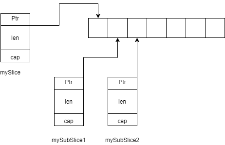

# learning-go
These are my notes as i learn golang

## Getting Started
### Instalation
- **Windows**:
Download the executables from [golang download page](https://dl.google.com/go/go1.14.2.windows-amd64.zip) and extract it at `%userprofile%\apps`. Add `%userprofile%\apps\go\bin` to user PATH.
- **Linux**: Use the install script [here](./install/linux_install.sh) to install go and add `/usr/local/go/bin` to path
 
### Developement Environmet

## Index

1. [Basics](https://play.golang.org/p/ovvy2BhqHHO)

Sub-Slices

